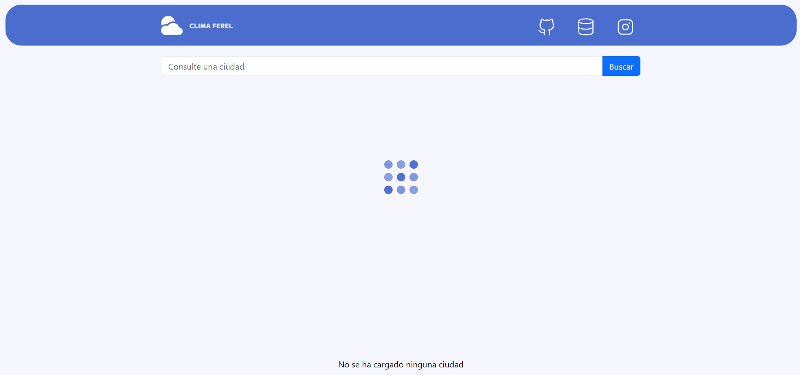
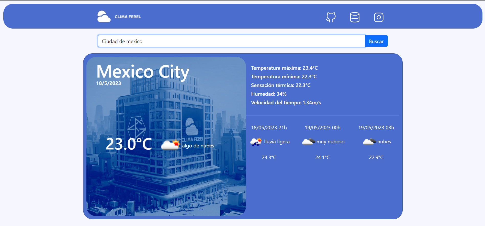

<body style="background-color: rgb(30, 89, 162);">
    

        
    

    

        <a style="color: #fff;" href="https://ferelias.github.io/clima-ferel/build/">Visitar Sitio</a>
    

    

        
    

    

        
    

    

        

            Clima Ferel, una aplicación diseñada con React. Clima Ferel te permite obtener información precisa y actualizada sobre el clima en cualquier ciudad del mundo. Conectada a la API Weather API, La aplicación te proporcionará el pronóstico meteorológico actual, así como los datos para los próximos tres días.
            Gracias a la API Weather API, tenemos acceso a una amplia gama de información meteorológica, incluyendo la temperatura actual, la humedad, la velocidad del viento y la descripción general del clima. Además, podrás visualizar el pronóstico extendido para los próximos tres días, lo que te permitirá planificar tus actividades de manera más efectiva.
        

    

</body>